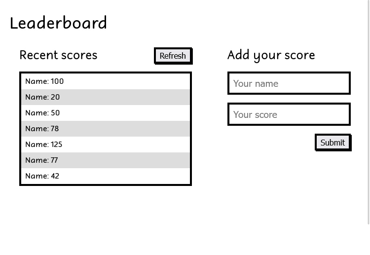

# Leaderboard

## 📗 Table of Contents

- [📖 Overview](#about-project)
  - [Project Objectives](#project-objectives)
  - [🛠 Built With](#built-with)
    - [Tech Stack](#tech-stack)
    - [Key Features](#key-features)
  - [🚀 Live Demo](#live-demo)
- [💻 Getting Started](#getting-started)
  - [Setup](#setup)
  - [Prerequisites](#prerequisites)
  - [Install](#install)
  - [Run tests](#run-tests)
  - [Deployment](#deployment)
- [👥 Authors](#authors)
- [🔭 Future Features](#future-features)
- [🤝 Contributing](#contributing)
- [⭐️ Show your support](#support)
- [🙏 Acknowledgements](#acknowledgements)
- [📝 License](#license)


## 📖 Overview <a name="about-project"></a>

The leaderboard website displays scores submitted by different players. It also allows you to submit your score. All data is preserved thanks to the external [Leaderboard API service](https://www.notion.so/microverse/Leaderboard-API-service-24c0c3c116974ac49488d4eb0267ade3). In this activity, the JavaScript project for the Leaderboard list app was set up using webpack and ES6 features, notably modules. The first working version of the app was developed following a [wireframe provided](https://github.com/microverseinc/curriculum-javascript/blob/main/leaderboard/m1_basic_structure.md). while in the later versions, the Leaderboard API will be consumed using JavaScript async and await and add some styling.

### Project Objectives <a name="project-objectives"></a>

- [ ] Write plain HTML markup with minimum styling (just to make the layout) using the wireframe below as a guide:

<h3 align="center">Wireframe Provided</h3>
<p align="center">
  
</P>


## 🛠 Built With <a name="built-with"></a>

### Tech Stack <a name="tech-stack"></a>

- [HTML](https://developer.mozilla.org/en-US/docs/Web/HTML)
- [JavaScript/ES6](https://262.ecma-international.org/6.0/)
- [webpack 5](https://webpack.js.org/)
- [npm](https://www.npmjs.com/)
- [Git](https://git-scm.com/)
- [GitHub](https://github.com)
- [Stylelinter](https://stylelint.io/)
- [ESLint](https://eslint.org/)
- [Webhint](https://webhint.io/)
- [Lighthouse](https://ethcar.github.io/lighthouse/)
- [SASS](https://sass-lang.com/)

### Key Features <a name="key-features"></a>

- [x] Use ES6 modules, with import and export.

## 🚀 Live Demo <a name="live-demo"></a>

> [Live Demo Link](https://fmanimashaun.github.io/leaderboard/)

<p align="center">
  
</P>

## 💻 Getting Started <a name="getting-started"></a>

- [Optional] Install git bash to your machine to enable you to clone this repo.
- install Visual Studio to be able to host a local live version.
- Install a browser to view the local live version.

To get a local copy up and running follow these simple example steps.
### Setup <a name="setup"></a>

- Open your GitHub account the repository's [link](https://github.com/fmanimashaun/leaderboard)

### Prerequisites <a name="prerequisites"></a>

- Internet connection
- A github account
### Install <a name="install"></a>

- copy the repo's link and clone it by writing `git clone https://github.com/fmanimashaun/leaderboard.git` on your git bash terminal.
- `npm install` to install the dependencies
- run the following command to create a api key:
```
fetch("https://us-central1-js-capstone-backend.cloudfunctions.net/api/games/", {
  method: 'POST',
  body: JSON.stringify({ 
	"name": "<enter your desired game name here>" 
  }),
  headers: {
    'Content-type': 'application/json; charset=UTF-8',
  },
})
  .then((response) => response.json())
  .then((json) => console.log(json));
```
```
// you should get a response like this:

  {
	"result": "Game with ID: Zl4d7IVkemOTTVg2fUdz added."
  }
```
- Create a `.env` file and copy the game id and paste it as follows:`API_KEY=Zl4d7IVkemOTTVg2fUdz`
- add .env to .gitignore

### Run tests <a name="run-tests"></a>

- You can check for errors by running linter tests found in the github flows.

### Deployment <a name="deployment"></a>

- run `npm run start` to run it locally.

## Authors <a name="authors"></a>

👤 **Engr. Animashaun Fisayo**

- [GitHub](https://github.com/fmanimashaun)
- [Twitter](https://twitter.com/fmanimashaun)
- [LinkedIn](https://www.linkedin.com/in/fmanimashaun/)
- [Website](https://fmanimashaun.com)

## 🤝 Contributing <a name="contributing"></a>

Contributions, issues, and feature requests are welcome!

Feel free to check the [issues page](../../issues/).

## ⭐️ Show your suppor <a name="support"></a>

Give a ⭐️ if you like this project!

## 📝 License <a name="license"></a>
This project is [MIT](./LICENSE) licensed.
